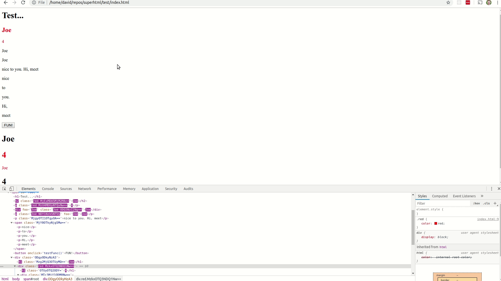

# Homework 5 Checkpoint - SuperHTML

- What you planned on doing for this homework deadline
  - On this date I will have the final version of my demo, library, and benchmarking results completed. I’ll be benchmarking the CPU and memory used by each different library. The main differences between this due date and the last will be finishing touches on my demo and completing the benchmarking results for my demo written in SuperHTML and complementary applications written in React and Vue. 
- What you actually acomplished for this deadline
  - For this deadline I have completed my final version of the SuperHTML library at this time, I have a version of my demo that shows basic SuperHTML features, I benchmarked SuperHTML and React with data from feedvix.com (another personal project website that aggregates interesting content). The results of this benchmark are contained in `bechmarks`. Changes I made to the SuperHTML library itself between last checkpoint and this one were mainly all related to supporting nested objects in SuperHTML state. I needed to parse nested object expressions like `state.foo.nested.something.else`, store the entire chain in the updateMap, nest a copy of my main proxy throughout all nested objects within the state, find the full path given just a prop and a value from any of the nested proxies, and remove any prototype functions from the nested state key. Ex: `state.foo.nested.something.else.map(val => val)` => `foo.nested.something.else`. Nested objects within state was really the last most important core aspect of SuperHTML as typically components will utilize nested objects to self contain state. Nested object support allows more complex types of UIs and updates to be assembled with SuperHTML. 
- What you had planned to do for the next deadline
  - Planned
    - I'll be working on my project presentation
  - Changes
    - I don't plan to have any changes for my next checkpoint. 
- Screenshots/gifs of where your app/program is current at
  - 
  - 
  - 
