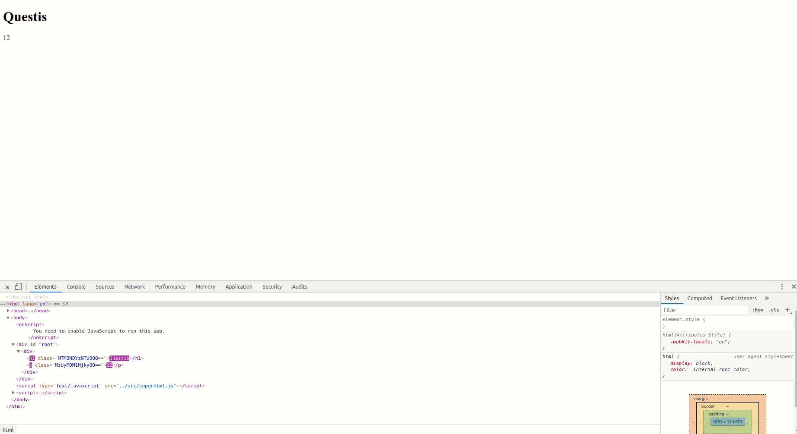
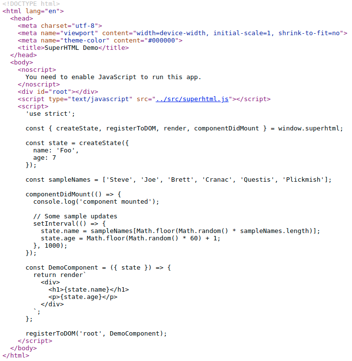

# Homework 3 Checkpoint - SuperHTML

- What you planned on doing for this homework deadline
  - On this due date I will have completed all the core API features, all content insertion and replacement types, and SuperHTML should work as expected when attempting to render a single component. I will also have a basic demo illustrating the API and features so far. This demo will basically act as a driver for the library itself as it is innate without being instantiated. The demo will have the following replacement content types implemented: replaceContent and replaceAttribute. The demo will have the following parsing matches implemented: stateKey within html element, stateKey within html element attribute, JS expression with stateKey. I will also submit the initial SuperHTML library at this point. 
- What you actually acomplished for this deadline
  - I completed all of the core API features: registerToDOM, render, createState, and componentDidMount. The parsing in render allows for the user to create instances of content and attribute replacement/insertion however attributes are still a little buggy due to the current parsing schemes. I will be slightly changing my parsing for the next deadline to rectify this. The demo demonstrates content replacement on an interval of 1 second. The values of an H1 and P tag are dynamically updated with code inserted into the componentDidUpdate function as a callback. The render function is able to parse stateKey within html element, stateKey witin html element attribute, JS expression with stateKey however I have decided to change my parsing for the next checkpoint in order to be better positioned to handling more complex cases. 
- What you had planned to do for the next deadline
  - Planned
    - On this due date I will have implemented SuperHTML’s ability to compose components. This will be one of the most important features as it’s key to making SuperHTML a usable web development framework in the real world. I’ll be aiming for a react/vue like component composition scheme where you can import another SuperHTML component at the top of the file and just include it in the render method of the parent component. I will have a new modified version of the last demo I created expect with composed components added. I will also resubmit the SuperHTML library at the point.
  - Changes
    - Like I said in the what I acomplished section I am planning on changing my parsing slightly in order to fix problems that will arise later with more complex types of html element and state structures. Specifically I'm going to treat all instances of text within curly brackets as a JS expression which I'll run in a sandboxed function. I'll parse the result of that in order to build the structure correctly instead of just parsing for stateKeys. My original idea worked fine for the proof of concept however it fails for more complex JS expressions and usage of multiple state keys in a single expression. I may have to push back component composition to the deadline after next instead of the next depending on how long my refactor of render takes. Fortunately all I had planned after composition was creating my demo which will definitely be the easiest part of my project. 
- Screenshots/gifs of where your app/program is current at
  - 
  - 