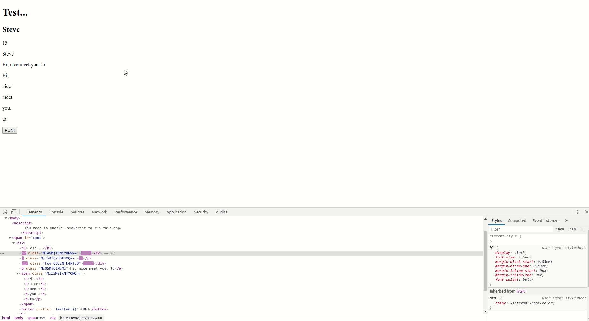

# Homework 4 Checkpoint - SuperHTML

- What you planned on doing for this homework deadline
  - On this due date I will have implemented SuperHTML’s ability to compose components. This will be one of the most important features as it’s key to making SuperHTML a usable web development framework in the real world. I’ll be aiming for a react/vue like component composition scheme where you can import another SuperHTML component at the top of the file and just include it in the render method of the parent component. I will have a new modified version of the last demo I created expect with composed components added. I will also resubmit the SuperHTML library at the point. Updates from my previous document: I am planning on changing my parsing slightly in order to fix problems that will arise later with more complex types of html element and state structures. Specifically I'm going to treat all instances of text within curly brackets as a JS expression which I'll run in a sandboxed function. I'll parse the result of that in order to build the structure correctly instead of just parsing for stateKeys. My original idea worked fine for the proof of concept however it fails for more complex JS expressions and usage of multiple state keys in a single expression. I may have to push back component composition to the deadline after next instead of the next depending on how long my refactor of render takes. Fortunately all I had planned after composition was creating my demo which will definitely be the easiest part of my project.
- What you actually acomplished for this deadline
  - I completely re did my render function and changedt the way I parse the initial HTML string. With this new update JS expressions now work within curly brackets. Replace content and attribute work well besides a small parsing bug on attribute replacement which I'll resolve in the next checkpoint. I also added a template function as nested template literals are not allowed within the render tagged template. I began working on composition but have not pushed any of that work to master as it is still in early stages. Given the new parsing update SuperHTML can now be used to make much more complicated forms of state updates with JS expressions. An example of this is included in the demo. I have omitted attribute updates from the demo as they are currently buggy. 
- What you had planned to do for the next deadline
  - Planned
    - On this due date I should have a basic version of the demo. The SuperHTML library should be completed and the demo I’ll make should enumerate all of the features contained within. The final demo will consist of a copy of this website I have been working on lately: http://feedvix.com/. Feedvix is a feed aggregator that pulls data from various news sources, jeopardy questions, quotes, jokes, comics, and wikipedia. It is powered by an API running on a Heroku hosted Node.js server. The Feedvix API returns random data from its various modules. Infinite scroll will be implemented in my SuperHTML/React/Vue versions in order to demonstrate the updating features of both libraries. The existing Feedvix API makes this project more convenient as I will not have to build out an entirely new API or from a fake data source. The demo can really be any online application that requires user input and changes the internal and visible state based on that input. I may also refactor some of my previous websites in SuperHTML to express the simplicity of the library over existing solutions. 
  - Changes
    - I plan to acomplish everything I planned for the next deadline (just making a version of Feedvix in SuperHTML) however I will continue to work on parsing and composition. There is a small bug in the atttribute updates however I don't anticipate this to be much of a problem, it's just a parsing problem. Composition will be more difficult but I don't anticipate that to be much of a problem either. When planning my deadlines I gave myself a lot of buffer as the demos are quite easy to make after the library is completed.  
- Screenshots/gifs of where your app/program is current at
  - 
