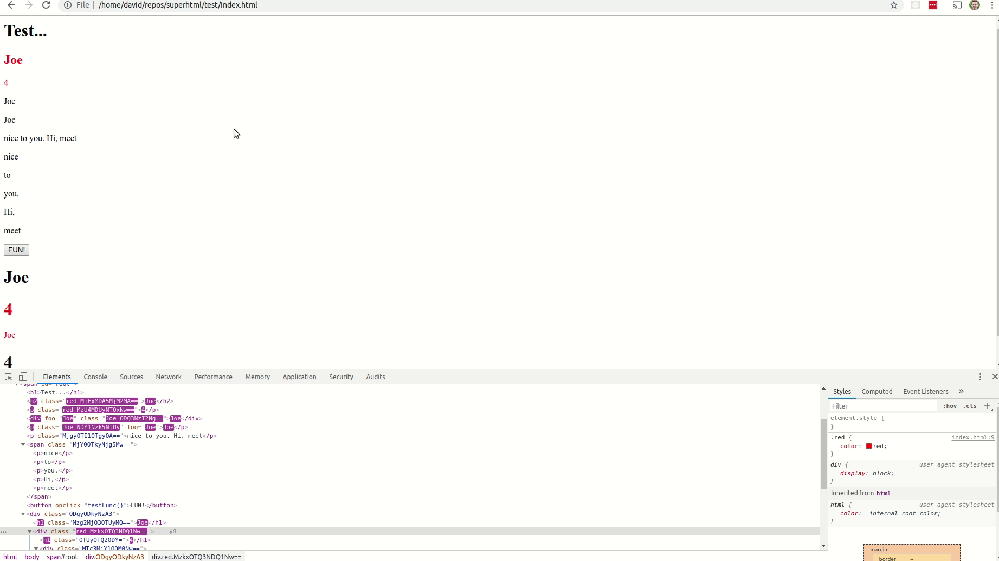

# Homework 5 Checkpoint - SuperHTML

- What you planned on doing for this homework deadline
  - On this due date I should have a basic version of the demo. The SuperHTML library should be completed and the demo I’ll make should enumerate all of the features contained within. The final demo will consist of a copy of this website I have been working on lately: http://feedvix.com/. Feedvix is a feed aggregator that pulls data from various news sources, jeopardy questions, quotes, jokes, comics, and wikipedia. It is powered by an API running on a Heroku hosted Node.js server. The Feedvix API returns random data from its various modules. Infinite scroll will be implemented in my SuperHTML/React/Vue versions in order to demonstrate the updating features of both libraries. The existing Feedvix API makes this project more convenient as I will not have to build out an entirely new API or from a fake data source. The demo can really be any online application that requires user input and changes the internal and visible state based on that input. I may also refactor some of my previous websites in SuperHTML to express the simplicity of the library over existing solutions.
- What you actually acomplished for this deadline
  - I fixed the attribute error described previously in the Homework 4 checkpoint document. I enabled component nesting. I also began working on nesting proxies to allow the state object to contain nested objects in order for updates for those fields to be propagated. I also built another version of my simple demo that demonstrates new features added such as attribute replacement and component composition. 
- What you had planned to do for the next deadline
  - Planned
    - On this date I will have the final version of my demo, library, and benchmarking results completed. I’ll be benchmarking the CPU and memory used by each different library. The main differences between this due date and the last will be finishing touches on my demo and completing the benchmarking results for my demo written in SuperHTML and complementary applications written in React and Vue. 
  - Changes
    - I don't plan to have any changes for my next checkpoint. 
- Screenshots/gifs of where your app/program is current at
  - 
